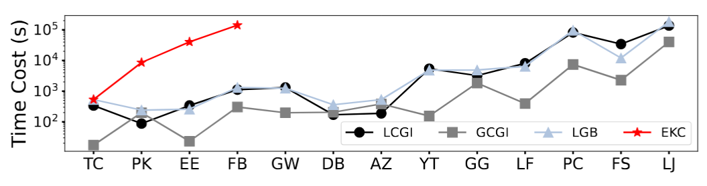

# CorenessMaximization

[WWW 2025(oral)] This is the source code of our paper "Coreness Maximization through Budget-Limited Edge Insertion".

##  Budget Limited Coreness Maximization Problem (BLCM)

User engagement in social networks is a key indicator that reflects user involvement level in the community. How to increase user engagement in a social network using a limited amount of budget is a crucial problem. This paper considers the coreness value of a vertex as an indicator of the user’s engagement in the social network. A case
study on the Gowalla dataset is illustrated in Figure below, which shows the average user check-ins versus the coreness values of the user (vertex). It is evident that the coreness value exhibits a strong positive correlation with the user engagement.


### Problem Definition

Insert at most $b$ edges into the network to maximize the sum coreness improvements of all the vertices.

## Methods


Our core algorithm is shown in the figure above. It uses three different greedy strategies and finally implements the LCGI, GCGI and LGB algorithms.

## Experiments

### Datasets
| Dataset       | Abbr. | n=\|V\| | m=\|E\| | $\overline{deg}$ | $deg_{max}$ | $k_{max}$ |
|--------------|-------|--------|--------|-----------------|------------|----------|
| twitter_copen | TC    | 8,580  | 473,614 | 110             | 1,516      | 582      |
| pkustk02     | PK    | 10,800 | 410,400 | 76              | 155        | 71       |
| Email-Enron  | EE    | 36,692 | 183,831 | 10.02           | 1,383      | 43       |
| Facebook     | FB    | 63,731 | 817,035 | 25.64           | 1,098      | 52       |
| Gowalla      | GW    | 196,591 | 950,327 | 9.67            | 14,730     | 51       |
| DBLP         | DB    | 317,080 | 1,049,866 | 6.62           | 343        | 112      |
| Amazon       | AZ    | 334,863 | 925,872 | 5.53            | 549        | 6        |
| youtube      | YT    | 495,957 | 1,936,748 | 7.81           | 25,409     | 49       |
| Google       | GG    | 875,713 | 4,322,051 | 9.87           | 6,332      | 44       |
| lastfm       | LF    | 1,191,805 | 4,519,330 | 7.58         | 5,150      | 70       |
| pokec        | PC    | 1,632,803 | 30,622,564 | 37.51       | 14,854     | 47       |
| flixster     | FS    | 2,523,386 | 7,918,801 | 6.28         | 1,474      | 68       |
| LiveJournal  | LJ    | 4,847,571 | 68,993,773 | 28.46       | 20,333     | 372      |

### Coreness Gain

We compare with the heuristic algorithms on 13 datasets and the results are depicted in below. It can be seen that the proposed LCGI, GCGI, and LGB algorithms all achieve remarkably higher coreness gain improvement than the four heuristic algorithms. LGB performs slightly better than LCGI and GCGI for it switches between the two policies adatively. Simple degree-based edge selections perform even worse than the random edge insertion in some datasets, showing the BLCM problem’s non-intuitiveness.


### Time Cost



As the graph size increases, the time-costs of the three proposed algorithms show a slow increasing trend. GCGI usually takes less time. Though LGB usually takes a longer time, it does not merely sum up the time costs of LCGI and GCGI. This is primarily because the fusion of the two greedy strategies results in alterations of the running rounds. 

## Experiment Settings

 All algorithms are implemented in C++ and compiled by g++ compiler at -O3 optimization level, and they are conducted on a machine with Inter(R) Xeon(R) CPU E5-2667 v4@3.20GHz processor and 128GB memory, with Ubuntu installed.

## Compile

```shell
cd CorenessMaximization
cmake .
make
```

## Run

```shell
./run.sh
```

The shell script automatically runs three core algorithms, LCGI, GCGI, LGB. The corresponding output will automatically generate an output folder and remain in the corresponding file. The initial default b setting is 50.
